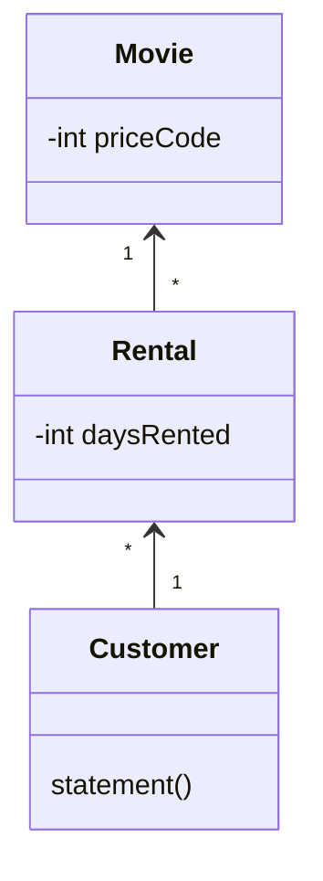
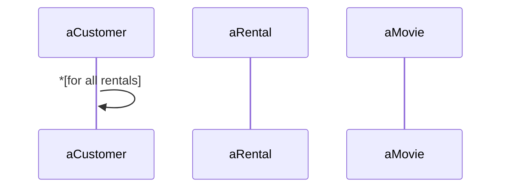

## 第一章 - 重構，第一個案例

不用過於複雜，也不用過於簡單的範例來介紹重構。

### 1.1 起點

這一節用影片出租店使用的程式，說明這個程式的規格：
1. 計算每一位顧客的消費金額並列印報表；
2. 操作者告訴程式：顧客租了哪些影片、租期多長，程式便根據租賃時間和影片類型算出費用；
3. 影片分為三類：普通片、兒童片、新片；
4. 要為常客計算點數，點數會隨著「租片種類是否為新片」而有不同。



```java
public class Movie {
  public static final int CHILDRENS = 2;
  public static final int REGULAR = 0;
  public static final int NEW_RELEASE = 1;
  
  private String _title;
  private int _priceCode;

  public Movie(String title, int priceCode) {
    _title = title;
    _priceCode = priceCode;
  }

  public int getPriceCode() {
    return _priceCode;
  }

  public void setPriceCode(int arg) {
    _priceCode = arg;
  }

  public String getTitle() {
    return _title;
  }
}
```

```java
class Rental {
  private Movie _movie;
  private int _daysRented;

  public Rental(Movie movie, int daysRented) {
    _movie = movie;
    _daysRented = daysRented;
  }

  public int getDaysRented() {
    return _daysRented;
  }

  public Movie getMovie() {
    return _movie;
  }
}
```

```java
class Customer {
  private String _name;
  private Vector _rentals = new Vector();

  public Customer(String name) {
    _name = name;
  }

  public void addRental(Rental arg) {
    _rentals.addElement(arg);
  }

  public String getName() {
    return _name;
  }

  public String statement() {
    double totalAmount = 0;
    int frequentRenterPoints = 0;
    Enumeration rentals = _rentals.elements();
    String result = "Rental Record for " + getName() + "\n";

    while(rentals.hasMoreElements()) {
      double thisAmount = 0;
      Rental each = (Rental) rentals.nextElement();

      // determine amounts for each line
      switch(each.getMovie().getPriceCode()) {
        case Movie.REGULAR:
          thisAmount += 2;
          if(each.getDaysRented() > 2)
            thisAmount += (each.getDaysRented() - 2) * 1.5;
          break;
        
        case Movie.NEW_RELEASE:
          thisAmount += each.getDaysRented() * 3;
          break;
        
        case Movie.CHILDRENS:
          thisAmount += 1.5;
          if(each.getDaysRented() > 3)
            thisAmount += (each.getDaysRented() - 3) * 1.5;
          break;
      }

      // add frequent renter points
      frequentRenterPoints ++;
      // add bonus for a two day new release rental
      if ((each.getMovie().getPriceCode() == Movie.NEW_RELEASE) && each.getDaysRented() > 1)
        frequentRenterPoints ++;
      
      // show figures for this rental
      result += "\t" + each.getMovie().getTitle() + "\t" + String.valueOf(thisAmount) + "\n";
      totalAmount += thisAmount;
    }

    // add footer lines
    result += "Amount owed is " + String.valueOf(totalAmount) + "\n";
    result += "You earned " + String.valueOf(frequentRenterPoints) + " frequent renter points";
    return result;
  }
}
```

三個類別之間的交互時序圖：

